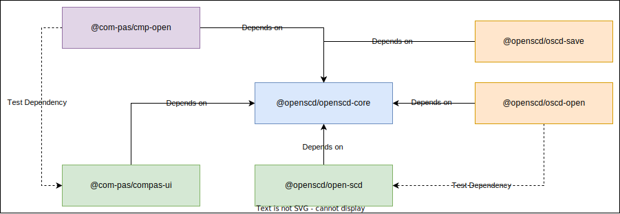

# OpenSCD Core should support Addons

Date: 2023-06-05

## Status

Accepted

## Context
The OpenSCD-core package currently consists of the custom WebComponent `open-scd` and the agreed upon API's + custom Events.
This means that every plugin that uses the API or custom Events from OpenSCD-Core, needs to have `open-scd-core` as a NPM dependency (or copy the needed code for itself).

## Decision
`OpenSCD-Core` should be split up into multiple packages. This way, plugins can directly depend on `OpenSCD-Core` (Which contains the agreed API).

### Solution
We can split up `OpenSCD-Core` into multiple packages; 1 Package that contains the custom WebComponent `OpenSCD`. 1 Package that contains the agreed API.
The custom WebComponent is depending on the package that has the agreed API.

All the plugins have a dependency (if needed) on the agreed API.

